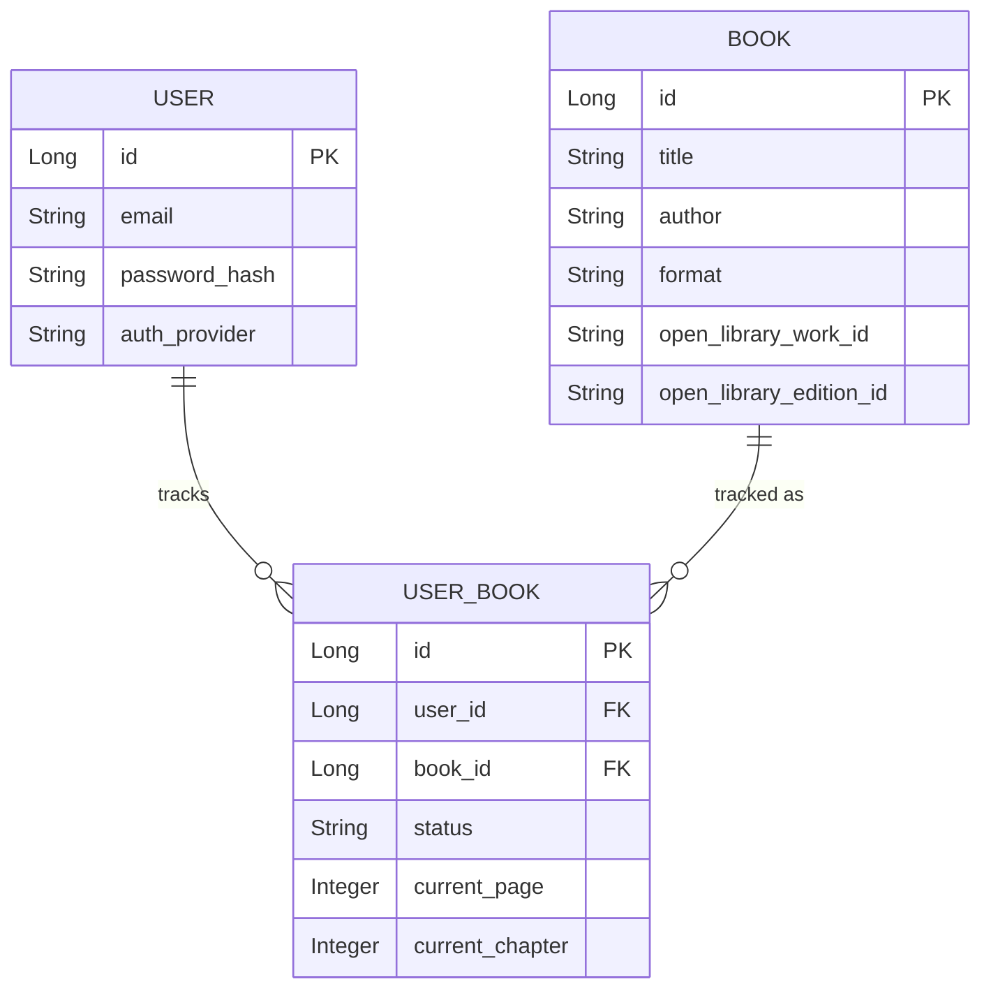

# LoreKeeper — Book/Comic Tracker: Requirements & Build Spec

> A personal reading tracker for books, comics, and manga. All tracking data is
> user-generated. Metadata lookup is optional, via Open Library — a free API
> explicitly built and licensed for exactly this kind of use case. Tracking is
> done at the **edition** level, so page counts are accurate to the specific
> printing a user actually owns/reads, not an average across all editions.

---

## 1. Goal (plain English)

A personal reading tracker. A user can manually add any book, comic, or manga —
either by typing the details themselves, or by searching Open Library, picking
a specific work, then picking a specific edition of it, to auto-fill title,
author, cover, and an accurate page count. They track progress (pages or
chapters, depending on format), mark items as reading/completed/dropped, and
can log in either the traditional way (email/password) or via "Sign in with
Google" (OAuth).

---

## 2. In scope vs. out of scope

**In scope:**
- Manual add/edit/delete of tracked items (book, comic, or manga)
- Open Library search: work → editions → pick a specific edition, to auto-fill accurate metadata
- Progress tracking (current page **or** current chapter, depending on format)
- Reading status: `WANT_TO_READ`, `READING`, `COMPLETED`, `DROPPED`, `ON_HOLD`
- User accounts: traditional email/password **and** Google OAuth
- Each user's tracked items are private to them

**Explicitly out of scope:**
- Auto-syncing new chapters/updates from any external reading platform
- Searching/importing directly from any specific webnovel/webcomic site
- Full-text reading inside the app (this is a tracker, not a reader)

---

## 3. Open Library integration — confirmed, real endpoints and flow

Confirmed directly from Open Library's official docs. This is a genuine
**three-step lookup**, since edition-level accuracy requires drilling down from
a general search result to one specific printing.

### Step 1 — search for the work
```
GET https://openlibrary.org/search.json?title={query}&fields=key,title,author_name,first_publish_year,edition_count,number_of_pages_median
```
Returns a list of **works** (the abstract book), each with a `key` like `/works/OL27448W`.

**Useful optimization, confirmed from real usage docs:** if `edition_count` for a
work is exactly `1`, `number_of_pages_median` is guaranteed to equal the actual
page count — safe to use directly, skipping steps 2 and 3 entirely for that case.

### Step 2 — list editions of the chosen work
```
GET https://openlibrary.org/works/{workId}/editions.json?limit=20
```
Returns a list of specific editions (different translations/printings), each with
their own `key` like `/books/OL17987798M`, and usually a `title`.

### Step 3 — fetch full detail for the chosen edition
```
GET https://openlibrary.org/books/{editionId}.json
```
Returns the confirmed, reliable per-edition detail — including `number_of_pages`,
`title`, `publish_date`, `covers` (array of cover ids). This is the field to trust
for an accurate page count.

**Cover image URL pattern** (built from a cover id returned above):
```
https://covers.openlibrary.org/b/id/{coverId}-L.jpg
```
(`-S`, `-M`, `-L` = small/medium/large)

**Rate limits (must be respected):**
- Unidentified requests: 1 request/second
- Identified requests (with a `User-Agent` header containing app name + contact email): 3 requests/second
- Example: `User-Agent: LoreKeeper (your-email@example.com)`

**Explicit "please do not" list from their own docs:**
- Don't scrape HTML pages (use the API)
- Don't distribute traffic across multiple IPs to dodge limits
- Don't harvest data in bulk
- Don't make hundreds of single-book requests

**Implication for our design:** always send a `User-Agent` header. Steps 2 and 3
should only fire when a user is actively drilling down to add a specific book —
never in a background/bulk job. Cache work-level search results briefly if the
same query is repeated.

---

## 4. Database schema

### `users`
| Column | Type | Notes |
|---|---|---|
| `id` | `Long` (PK) | |
| `email` | `String`, unique, `@NotBlank` | |
| `password_hash` | `String`, nullable | null if the user only ever signs in via OAuth |
| `auth_provider` | `String` | `"LOCAL"` or `"GOOGLE"` |
| `provider_id` | `String`, nullable | Google's unique user id, only set for OAuth users |
| `created_at` | `LocalDateTime` | |

### `books`
Represents one specific **edition** — not the abstract work.

| Column | Type | Notes |
|---|---|---|
| `id` | `Long` (PK) | |
| `title` | `String`, `@NotBlank` | edition-specific title (can differ slightly from the work's general title) |
| `author` | `String`, `@NotBlank` | |
| `summary` | `String`, nullable | optional, often not reliably available at all |
| `cover_image_url` | `String`, nullable | built from the edition's cover id |
| `format` | `String` | `"BOOK"`, `"COMIC"`, `"MANGA"` — decides whether progress is tracked in pages or chapters |
| `total_pages` | `Integer`, nullable | sourced from `number_of_pages` at edition level when available via Open Library |
| `total_chapters` | `Integer`, nullable | used when `format = COMIC`/`MANGA` |
| `open_library_work_id` | `String`, nullable | e.g. `"OL27448W"` — the abstract work this edition belongs to |
| `open_library_edition_id` | `String`, nullable | e.g. `"OL17987798M"` — the specific edition, if sourced via Open Library |
| `added_by_user_id` | `Long` (FK → `users.id`) | who first added this catalog entry |

### `user_books` (tracking/progress — join entity, one per user per book)
| Column | Type | Notes |
|---|---|---|
| `id` | `Long` (PK) | |
| `user_id` | `Long` (FK → `users.id`) | |
| `book_id` | `Long` (FK → `books.id`) | |
| `status` | `String` | `WANT_TO_READ` / `READING` / `COMPLETED` / `DROPPED` / `ON_HOLD` |
| `current_page` | `Integer`, nullable | progress if `format = BOOK` |
| `current_chapter` | `Integer`, nullable | progress if `format = COMIC`/`MANGA` |
| `rating` | `Integer`, nullable | 1–5, optional |
| `is_favorite` | `boolean`, default false | |
| `started_at` | `LocalDateTime`, nullable | |
| `completed_at` | `LocalDateTime`, nullable | |



**Why a separate `user_books` join table, instead of putting progress directly on `books`:** the same edition can be tracked by many different users, each with their own independent progress/status/rating. Putting `current_page` directly on `books` would mean every user shares the same progress — clearly wrong once multiple users exist. This is a genuine many-to-many relationship (users ↔ books), with extra data (`status`, progress, rating) attached to each connection.

**Why `open_library_work_id` AND `open_library_edition_id` are both stored:** the work id lets you later show "other editions of this same book" or re-search if needed; the edition id is what actually determines the accurate `total_pages` and cover shown. Storing only one or the other would lose real information.

---

## 5. API contract

### Auth (requires no token)
| Method | Path | Purpose |
|---|---|---|
| `POST` | `/auth/register` | traditional signup |
| `POST` | `/auth/login` | traditional login, returns JWT |
| `POST` | `/auth/google` | complete Google OAuth flow, accepts idToken in body, returns JWT |

### Local book catalog
| Method | Path | Auth | Purpose |
|---|---|---|---|
| `GET` | `/books` | Public | list all books in the local catalog |
| `GET` | `/books/{id}` | Public | get a specific book's details |
| `POST` | `/books` | Required | create a book catalog entry (manual or from Open Library data) — deduplicates by `open_library_edition_id` |
| `PUT` | `/books/{id}` | Required | update an existing book |
| `DELETE` | `/books/{id}` | Required | delete a book |

### Open Library proxy (external search — all public)
| Method | Path | Purpose |
|---|---|---|
| `GET` | `/open-library/works?title=...` | Step 1 — search Open Library, return matching works |
| `GET` | `/open-library/works/{workId}/editions` | Step 2 — list editions of a chosen work |
| `GET` | `/open-library/editions/{editionId}` | Step 3 — full detail for a chosen edition (page count, cover) |

### User library (tracking — all require auth)
| Method | Path | Purpose |
|---|---|---|
| `GET` | `/users/me/library?status=...&q=...` | list the logged-in user's tracked books, with optional filters |
| `GET` | `/users/me/library/{libraryEntryId}` | get a single tracked book's full details |
| `POST` | `/users/me/library` | start tracking a book (`bookId`, initial `status`) |
| `PATCH` | `/users/me/library/{libraryEntryId}` | update progress/status/rating/favorite |
| `DELETE` | `/users/me/library/{libraryEntryId}` | stop tracking a book |

### User profile (requires auth)
| Method | Path | Purpose |
|---|---|---|
| `GET` | `/users/me` | get the logged-in user's profile (email, auth provider, created date) |

---

## 6. Things worth deciding before we start building (gaps worth flagging)

1. **Duplicate books:** if two different users both add the same edition, should that create two separate `books` rows, or should the second user's action just link to the existing one (matched by `open_library_edition_id`)? Recommend: check for an existing match first, reuse it if found.
2. **Manual entries without an Open Library match:** totally fine, both `open_library_*` fields just stay null.
3. **Extra API calls:** edition-level accuracy means up to 3 Open Library calls per book add (search → editions → edition detail), instead of 1. Acceptable for a personal tracker's usage volume, but worth being aware of — apply the `number_of_pages_median` shortcut (Section 3) when a work has only one edition, to skip steps 2–3 entirely in that case.
4. **Comics/manga chapter counts change over time** (ongoing series) — `total_chapters` should stay editable after creation, since ongoing series grow.
5. **Rating and favorite** — worth confirming you actually want these; easy to drop if not.
6. **Password hashing** — will need `BCryptPasswordEncoder` (Spring Security) for traditional auth; never store `password_hash` as plain text.
7. **OAuth security note:** for Google sign-in, we never receive or store the user's Google password — Google handles authentication entirely, and only tells us a verified email + provider id.

---

## 7. Suggested build order

1. `Book` entity + manual CRUD — no auth yet, no Open Library yet
2. `OpenLibraryService` — the 3-step search/editions/detail flow, read-only, no writes
3. `User` + `UserBook` — the many-to-many-with-extra-data relationship
4. Traditional auth (register/login, JWT, password hashing)
5. Google OAuth, added alongside traditional auth
6. Progress tracking endpoints (`PATCH /user-books/{id}`)
7. Testing pass across everything above
8. Production polish, frontend
